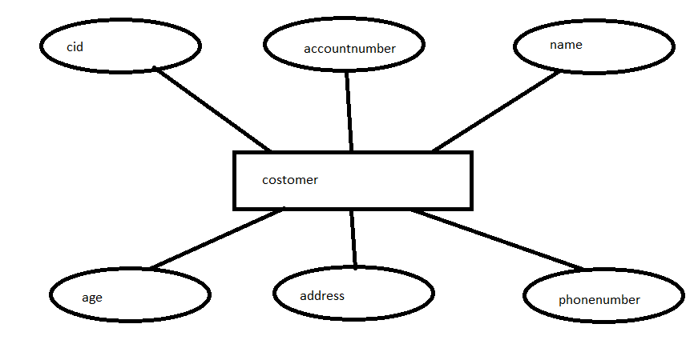

# Ex02 Django ORM Web Application
## Date: 11.11.2024

## AIM
To develop a Django application to store and retrieve data from a bank loan database using Object Relational Mapping(ORM).

## ENTITY RELATIONSHIP DIAGRAM



## DESIGN STEPS

### STEP 1:
Clone the problem from GitHub

### STEP 2:
Create a new app in Django project

### STEP 3:
Enter the code for admin.py and models.py

### STEP 4:
Execute Django admin and create details for 10 books

## PROGRAM
```
models.py

from django.db import models
from django.contrib import admin
class Costumer(models.Model):
   cid=models.CharField(max_length=20,primary_key="cid")
   accountnumber=models.IntegerField()
   name=models.CharField(max_length=20)
   age=models.IntegerField()
   address=models.CharField(max_length=50)
   phonenumber=models.IntegerField()


class CostumerAdmin(admin.ModelAdmin):
   list_display=('cid','accountnumber','name','age','address','phonenumber')

admin.py

from django.contrib import admin
from.models import Costumer,CostumerAdmin
admin.site.register(Costumer,CostumerAdmin)

```


## OUTPUT

.png>)


## RESULT
Thus the program for creating a database using ORM hass been executed successfully.
